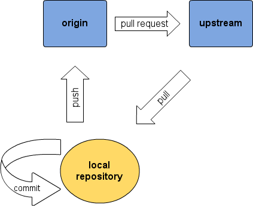

.. _addit:

Advanced and additional topics
=============================================

.. _gitcollab:

Collaborating with git and GitHub
-----------------------------------

Git is a decentral version control system (http://git-scm.com/). This 
means among other things that:

* Each checked out copy of the code has the full version history.
* There is no central repository, all repos are equal (but some *can* be made more equal than others, as we'll see below).
* Commits happen locally into your working repo, no network connection needed.
* Repos are updated and synced with each other by pushing and pulling commits back and forth between them. 
* There are web-platforms that offer free web-repositories which facilitates syncing and merging. We'll use GiutHub (http://www.github.com/).

The setup that we want looks like this:

* The **local repo** is the one that you work in and where you run all 
  the commands that will be mentioned below. We'll get to how you create your
  local repo in a minute.
* Your **origin** is your repo at GitHub. This is where you push the 
  commits to that you made in your local repo.
* **Upsream** is the repo that serves as a "central" where all collaborators'
  changes are merged. It lives on GitHub, too. Upstream is from where 
  you pull other's updates into your
  local repo. Upstream is also where you send a *pull request* when you want
  your commits that you pushed to your **origin** to be propagated to
  everybody else.
* You can certainly have **several local repos**, e.g. one on your laptop, 
  one on your desktop and one on the server where the node runs. You 
  then use your **origin** to keep them in sync. For example: You work 
  from your laptop and commit your changes there. You then push them to 
  your origin and tell your other local repos to pull from origin, if you 
  want them up-to-date immediately.
  

Now enough with theory, let's do this in practice. To create your own 
repositories (origin and local) do the following:

* Go to http://github.com and make an account. This includes that you 
  (create and) upload an ssh-key to be able to pull and push securely and 
  with typing your password all the time. Simply follow the instructions
  on GitHub.
* Visit the repository at https://github.com/VAMDC/NodeSoftware and
  klick "fork" in the upper right corner. This will make a copy of the
  original repository under your account. This is your **origin** (see above).
  For more information on forking, you can read http://help.github.com/forking/.
* Github will give you instructions on how to *clone* your origin
  to your own computer, thereby creating a local repo, aka your "working copy". 
* You can repeat the cloning on as many machines as you see fit.
* Tell your local repos where **upstream* is by running the following
  command in each of them: *git remote add upstream git://github.com/VAMDC/NodeSoftware.git* 

Now that you are all set, a typical working session may look like this::

    $ cd $VAMDCROOT               # got to your local repo
    $ git status                  # should tell you you have a clean tree and are on the branch "master"
    $ git pull origin             # pull from your origin, in case you pushed things there from another of your local repos.
    $ git pull upstream           # fetch the latest from upstream and merge it with your tree.
    $ git log                     # read the commit log about what is new.
    $ ....                    # edit your files
    $ git status                  # review which files have changed
    $ git diff                    # review details of your changes
    $ git diff <filename>         # see canges in one file only
    $ git add <filename>          # add a file to be commited with the next commit, e.g. a new file
    $ git commit -a -m "message"  # commit all changed files. ALWAYS check the status before you use -a to prevent that you commit unwanted files.
    $ git commit -m "message" <filenames>   # commit, but include only the named files in the commit    
    $ ....                   # more edits, more commits. until, at the end of day:
    $ git status                  # also tells you how many commits you are ahead of your origin
    $ git push                    # push all commits to your origin, also the new ones that came from upstream.

.. note::
    There are several graphical user interfaces available for git that
    will facilitate overview and some operations for the less 
    command-line adept. Commonly uses ones for Linux are *gitk* and *gitg*.
    Good editors also integrate with git so that you can handle the 
    version control from within the editor.

A few dos and don'ts that are worthwhile to keep in mind with git:

* Do commit often. It goes instantly.
* Pull and push less often, but often enough. You certainly want to pull 
  from upstream before
  making changes, since you might work on outdated versions of files which
  will result in conflicts later. You also do no want to sit on your
  local commits for too long but push them frequently instead.
* Never pull into a dirty tree (i.e. one that has uncommitted changes). 
  Commit first, then pull. Alternatively read *git help stash*.
* Don't panic. Yes, git may have a comparably steep learning curve, but it
  is a powerful tool and all problems can be resolved.

Situations that commonly arise and how to solve them
~~~~~~~~~~~~~~~~~~~~~~~~~~~~~~~~~~~~~~~~~~~~~~~~~~~~~~~~

* Merge conflicts
* undo a commit
* the admin is picky about your commits

Commit guidelines
~~~~~~~~~~~~~~~~~~~~~~~~~

* *One thing at a time.*
* *Meaningful commit messages.*
* *Good code.*
* *Pull first.*

The admin of *upstream* (aka the writer of these lines) might be bribed 
and/or convinced to turn a blind eye on violations against the above 
points, but he will be very happy if you try to follow them.

The Django admin interface
---------------------------

Adding more views to your node
--------------------------------

